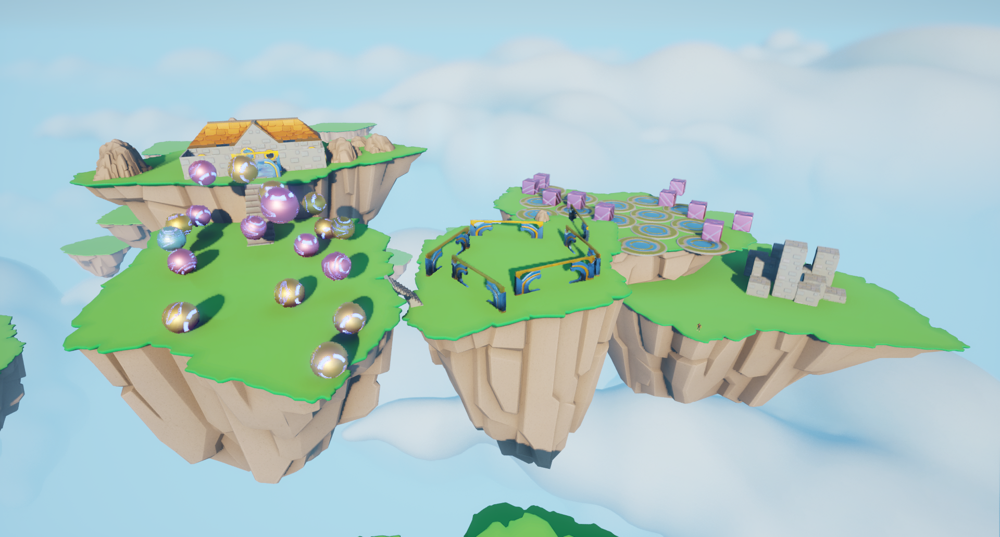

# ObstacleAssault Game
Obstacle Assault is a platform game featuring physics - based simulations of actors and character movement controlled through Blueprints.

## Game building

To successfully build and run this game locally, the following soft will be required:

- Unreal Engine 5.3 or upper
- Visual Studio Compiler with C++ 23 standart
- .NET 6

